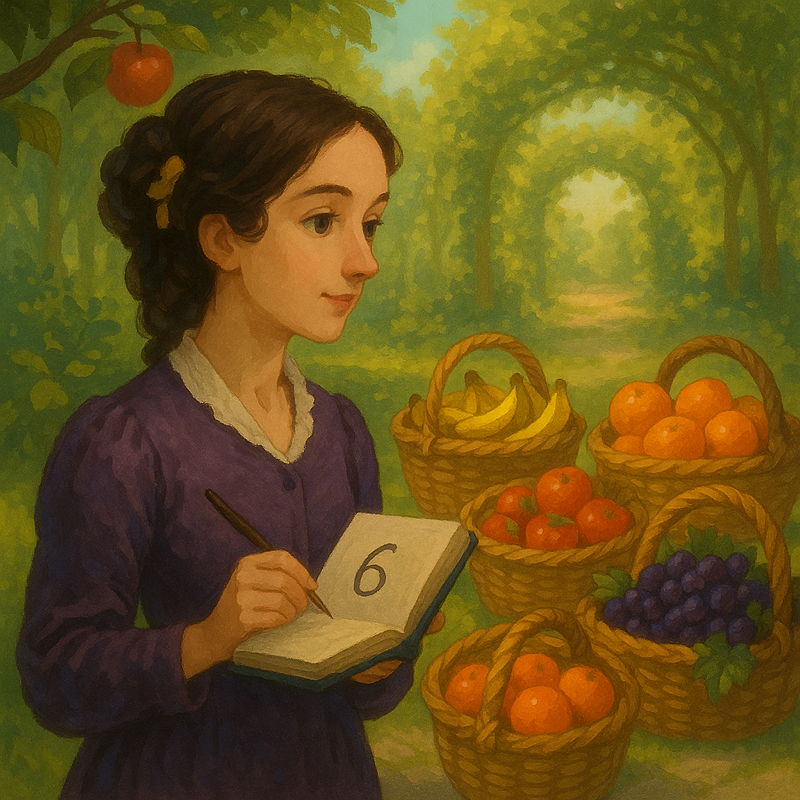

# Las Frutas de Ada

En una de sus visitas al jardín del Palacio de los Números, Ada Lovelace, pionera de la programación y amante de las matemáticas, fue invitada a preparar un banquete para celebrar el progreso de la ciencia.

Para el banquete, Ada ha recolectado frutas en $N$ cestas, donde cada cesta contiene exactamente $A_i$ frutas. Siempre tan lógica, Ada quiere asegurarse de que las frutas puedan dividirse en grupos del mismo tamaño, sin que sobre ninguna, para repartirlas de manera justa entre los invitados.

Ada no quiere calcular cada posibilidad manualmente. En su lugar, decidió analizar cuántas maneras distintas existen para agrupar todas las frutas en partes iguales, de forma que cada grupo tenga la misma cantidad de frutas y no quede ninguna fruta sobrante.



Tu tarea es ayudar a Ada a encontrar cuántos valores distintos cumplen esa condición.

## Entrada

La primera línea contiene un número entero $N$ ($1 \leq N \leq 10^5$) — el número de cestas de frutas.

La segunda línea contiene $N$ enteros $A_1$, $A_2$, ..., $A_n$ ($1 \leq A_i \leq 10^6$), la cantidad de frutas en cada cesta.

## Salida
Imprime un solo número entero, la cantidad de formas de dividir las frutas en grupos iguales. 

### Ejemplos

## Ejemplo 1

Entrada:
```
3
2 4 6
```

Salida:
```
6
```

Explicación:

La suma total de frutas es $2 + 4 + 6 = 12$.
Con 12 frutas hay 6 posibles formas de formar grupos del mismo tamaño sin que ninguna fruta se quede afuera.
- 1 grupo de 12 frutas
- 2 grupos de 6 frutas
- 3 grupos de 4 frutas
- 4 grupos de 3 frutas
- 6 grupos de 2 frutas
- 12 grupos de 1 fruta

## Subtareas

### Subtarea 1 (10 puntos)
- $1 \leq N \leq 1$
- $1 \leq A_i \leq 12$

### Subtarea 2 (35 puntos)
- $1 \leq N \leq 100$
- $1 \leq A_i \leq 1000$

### Subtarea 3 (55 puntos)
- $1 \leq N \leq 10^5$
- $1 \leq A_i \leq 10^6$
