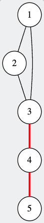

# Ada y los puentes de cristal

Durante una de sus expediciones a las tierras de la Ciencia, Ada Lovelace, pionera de la programación, visitó una ciudad maravillosa construida sobre puentes de cristal que unían diferentes barrios suspendidos en el aire.

Fascinada por la belleza y la fragilidad de la estructura, Ada se preguntó:

“¿Cuáles de estos puentes son esenciales para mantener la ciudad unida?”

Ella descubrió que algunos puentes eran tan críticos que, si llegaran a romperse, la ciudad quedaría dividida en partes separadas.

Inspirada por su amor a las matemáticas y la lógica, Ada decidió estudiar este problema:
encontrar cuántos puentes son verdaderamente esenciales para mantener a toda la ciudad conectada.


Tu tarea es ayudar a Ada a calcular cuántos puentes de cristal son críticos.

## Entrada
Una línea contiene dos enteros N y M — el número de barrios y el número de puentesen la ciudad.
($1 \leq N \leq 10^5$, $0 \leq M \leq 10^5$)

Luego siguen M líneas. Cada línea contiene dos enteros u y v ($1 \leq u, v \leq N$, $u \neq v$), indicando que existe un puente entre los barrios u y v.

Los puentes son bidireccionales y no hay puentes repetidos ni bucles.

## Salida
Imprime un solo número: la cantidad de puentes críticos en la ciudad.

## Ejemplos

### Ejemplo 1

Entrada:
```
5 5
1 2
2 3
3 1
3 4
4 5
```

Salida:
```
2
```

En la siguiente imagen se puede ver los pueblos y los puentes, los puentes en rojo son los 2 puentes critos.



## Subtareas

### Subtarea 1 (10 puntos)
- $1 \leq N \leq 2$
- $0 \leq M \leq 1$

### Subtarea 2 (10 puntos)
- $1 \leq N \leq 10^5$
- $0 \leq M \leq 10^5$
- Se garantiza que partiendo de cualquier pueblo se puede llegar a todos los demás pueblos con mínimo 2 caminos distintos

### Subtarea 3 (30 puntos)
- $1 \leq N \leq 100$
- $0 \leq M \leq 100$

### Subtarea 4 (50 puntos)
- $1 \leq N \leq 10^5$
- $0 \leq M \leq 10^5$
